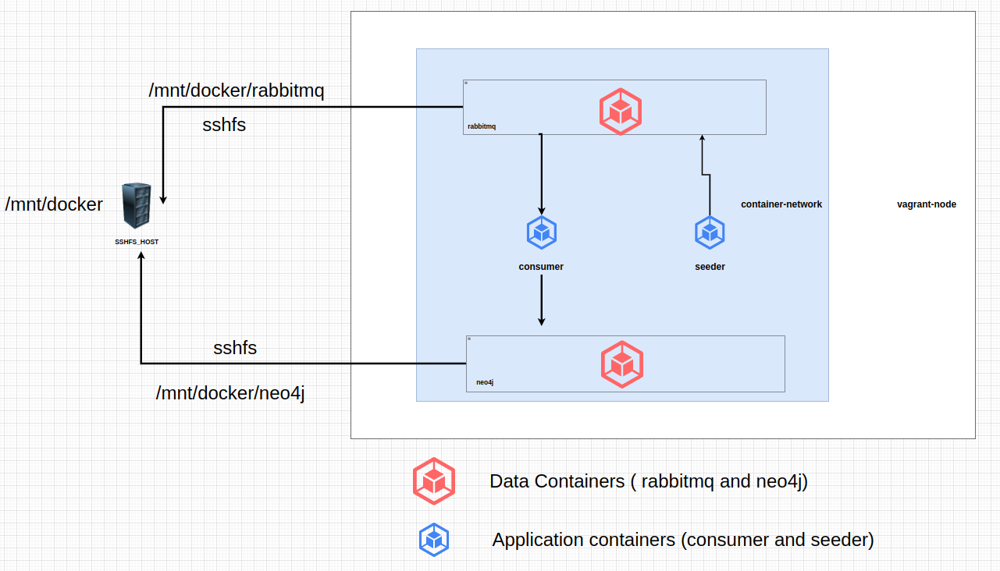
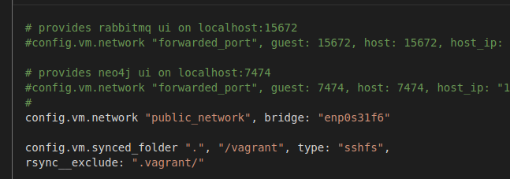
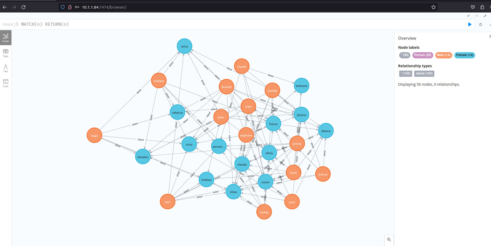

# 0. Project Description


## Intro

**MarysDatingEngine** is an app that provides you a fake network graph of  people who dated with others.

It can help **Mary** answer the question `with which other girls did her new crush Peter dated with`. With this graph analytics engine (powered by neo4j) in her hands, Mary can see if Peter has already dated other girls in her social circle, and is just trying to add her to his list too.

Away from the fun, the more serious aspects of the project include learning how sensitive container data could be persisted on an external host, so that in case of general failure or if application containers need to be momentarily stopped for further development and reloaded again, state could be preserved.

In summary a way to persist the state for my docker compose applications.

At the core, **MarysDatingEngine** is an app 

## Architecture.



### A. The seeder

This component is the one responsible for generating the relationships `A -[:dated]-> B`.
Out of a hard coded list of common names, it randomly maps two persons  A and B.

And pushes it to the rabbitmq as task.

### B. The consumer

This component's responsibility is to consume the tasks (couples) fed to it via rabbitmq, and create the relationship graph on neo4j.

### C. Rabbitmq

Decouples the consumer and seeder components, and acts as message broker between both.

### D. Neo4j

Hosts the relationship graph among people who dated.


# 1. SSHFS Host
---

## Role


The sole responsiblity of this host is to persist the data generated by our system which we deem important.

These data are:

1. The Noej4 graph, graph meta-data and logs
2. The persistent tasks held by rabbitmq


## Rationale


We avoid binding our important data to the container layers so that in case of general failure, we can resume operations with the last saved data.

Both queued tasks and graph database will survive crashes on a totally
separate host from the host on which lives the application system.

## Setup


Spin up any host of your choosing, and follow the procedure below

1. create the users `rabbitmq` and `neo4j` using the uids `999` and `7474` as shown below:

```bash
$ sudo useradd -u 999 rabbitmq
$ sudo useradd -u 7474 neo4j
```

2. set the passwords you want for the `rabbitmq` and `neo4j` users

```bash
$ sudo passwd rabbitmq
$ sudo passwd neo4j
```

3. Create the directory to which the docker volumes will be bound to

```bash
# For rabbitmq
$ sudo mkdir -p /mnt/docker/rabbitmq
$ sudo chown rabbitmq:rabbitmq -R /mnt/docker/rabbitmq

# For neo4j
$ sudo mkdir -p /mnt/docker/neo4j/{data,import,logs,plugins}
$ sudo chown neo4j:neo4j -R /mnt/docker/neo4j
```


**note**: These users have nothing to do with the actual containers, they're just the user's via which docker driver vieux/sshfs will map the volumes dedicated to the neo4j and rabbitmq containers to your SSHFs host filesystem.


# 2. Vagrant vm (app server)

## Setup


1. Edit the `example.env` and rename it to `.env` for docker-compose

- set the  `SSHFS_HOST` to the ip address of your SSHFS host
- set the  `SSHFS_RABBIT_PASSWORD` to the password you created for you rabbitmq user on the sshfs host.
- set the  `SSHFS_NEO4J_PASSWORD` to the password you created for your neo4j user on the sshfs host


2. Install vagrant-ssh plugin

```
$ sudo apt install -y vagrant-sshfs
```


3. In the Vagrantfile, change the bridge interface to the interface via which you can reach the SSHFS host. In my case it is `enp0s31f6`




4. Boot up the vm machine

```bash
$ vagrant up
$ vagrant ssh
```

5. start the app

```
$ cd /vagrant
$ make build
```


6. You can access the rabbitmq Ui on `bridged_ip:15672` with credentials `guest:guest`


7. You can access the neo4j Ui on `bridged_ip:7474` with credentials `neo4j:password1234`





